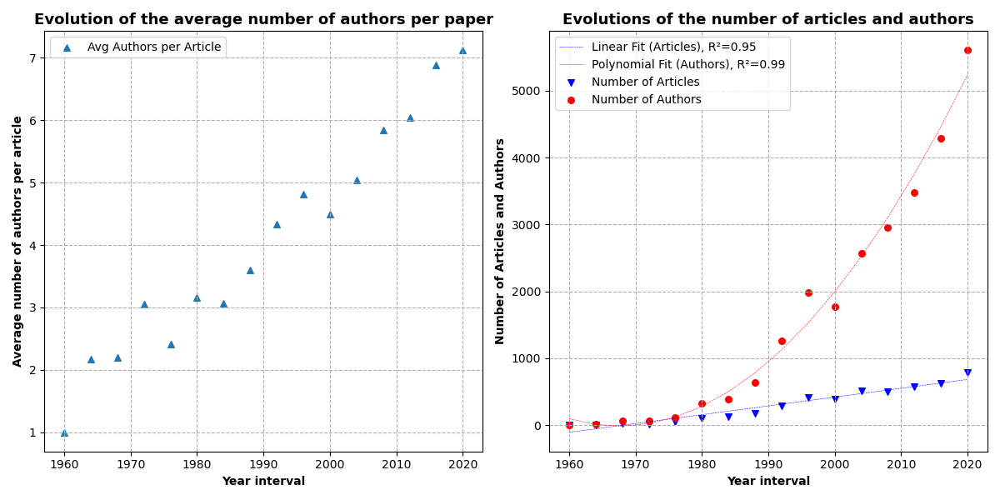
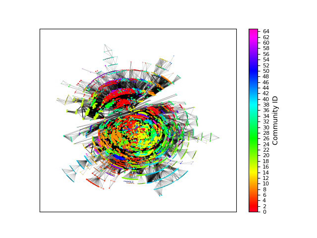

# PRADWIL

# Analysis of the Prader-Willi Syndrome Research Collaboration Network

## Abstract

The goal of this paper is to analyze the Prader-Willi syndrome (PWS) research community, through the lens of graph theory and social network analysis. In particular, the project focuses on the analysis of the co-authorship 
network within the scientific community dedicated to PWD research.

For this purpose, we collected a dataset containing all the published research on the PWS from the National Center for Biotechnology Information's PubMed database. 
We conducted a preliminary analysis of the dataset to study the evolution of the number of publications, the number of authors and the number of authors per paper over time.
Then, we constructed the aforementioned co-authorship network
and we characterized its structure by computing the main network metrics. 
We also investigated the scale-free property of the network by analyzing the power-law degree distribution.
Then, we identified the most influential authors in the largest connected component of the network by measuring centrality metrics, and we provided a final ranking using the Borda count method. 
Finally, we performed community detection on the largest connected component of the network using the Louvain algorithm.

## Introduction

Prader-Willi syndrome (PWS) is a genetic disorder and is recognized as the most common genetic cause of life-threatening childhood obesity.
According to the Foundation for Prader-Willi syndrome Research[^1], PWS occurs in approximately one out of every 15,000 births. It affects males and females with equal frequency and affects all races and ethnicities. 
Research findings serve as the foundation for advocacy efforts. It is crucial to raise awareness about PWS within the medical community, among policymakers, and in the general public. This is essential for garnering support and resources to advance research initiatives. Collaborative research on a global scale, involving researchers and healthcare professionals, can accelerate the pace of discovery, leading to more comprehensive insights and innovative solutions.

Graph theory, and particularly social network analysis, are crucial tools for evaluating the quality and effectiveness of research on Prader-Willi Syndrome.
In our project, we utilized tools developed in graph theory to systematically analyze the structure of the Prader Willi Syndrome research collaboration network.

The paper is organized as follows: 
in the Materials and Methods section, we provides details on data acquisition, computational tools and Python libraries employed in the analysis. Additionally, we describe the methods used for the characterization of the co-authorship network, the analysis of the scale free property of the network, the identification of the most influential nodes and the Louvain algorithm for community detection; in the Results section, we present and discuss the results of the analysis.
Finally, we reported our conclusions in the last section.

## Materials and Methods

### Data acquisition

We retrieved the data from the National Center for Biotechnology Information (NCBI), a division of the United States National Library of Medicine (NLM), specifically accessing the PubMed database[^2] . To collect the necessary articles for analysis, we utilized NCBI's e-utilities through a bash script on the UNIX command line [^3].

### Computational Tools and Python Frameworks Employed

All the code for data acquisition and plotting was executed on a machine with the following specifics:

| Hardware Component Specifics | Value |
| --- | --- |
| Processor | AMD Ryzen 5600X |
| Memory | 64GB DDR4 RAM (2400MHz, 4x16GB configuration) |
| Storage | 500GB NVMe SSD, Two 10TB HDDs |
| Graphics Processing Unit (GPU) | Nvidia RTX 2070 |
| Operating System | Linux Ubuntu 20.04 |

The computational framework utilized the capabilities of various software tools and libraries specifically chosen to meet the requirements of our research.
 
Notably, the the following Python libraries were employed for the network analysis and visualization:

- **NetworkX**: Utilized for the creation, manipulation, and analysis of complex networks and graph structures.
- **Matplotlib**: Employed for data visualization, including the creation of static, interactive, and animated plots.
- **Powerlaw**: Used for investigating the degree distribution of the coauthorship collaboration network and for
assessing its scale free property.

### Construction of the authors collaboration network

We start by constructing the author-paper bipartite network $G = (U, V, E)$, where the disjoint and independent sets of nodes $U$ and $V$ represent authors and papers, while the links between them denote the authorship relation. 
Subsequently, we derive the coauthorship collaboration network from the original bipartite network by projecting it onto the set of author nodes. 

In this new graph, denoted as $G' = (V, E)$, each author is represented by a vertex $v_i$, while the existence of an edge between two different authors means that there exists at least one path between them in the original bipartite graph $G$, indicating a shared paper.

We decided to employ a weighted projection of $G$ to obtain $G'$. The weight of each edge corresponds to the number of common nodes in the original bipartite graph $G$, reflecting the number of papers authors have published together. 

This network structure aligns with the concept that frequent collaborators should exhibit stronger connections in the coauthorship network compared to authors with fewer shared publications.

### Methods for the analysis of the authors collaboration network
#### Metrics for network characterization

The initial step in the analysis involves testing the connectivity of the graph and identifying its largest connected component.
Subsequently, we compute the following network metrics for the largest connected component:

- **Density**: 
The density of a graph is defined as the ratio between the number of edges in the graph and the maximum number of edges in a graph with the same number of nodes:

$$
D = \frac{2m}{n(n-1)}
$$

where $m$ is the number of edges in the graph and $n$ is the number of nodes in the graph.
The value of the density ranges from 0 to 1, and it is equal to 1 for a complete graph (a graph in which each node is connected to all other nodes), and it is equal to 0 for a graph without edges.

- **Average clustering coefficient (weighted and unweighted)**:

The local clustering coefficient in an undirected and unweighted graph for a node $i$ is defined as the fraction of potential triangles involving that node that actually exist in the graph, meaning the probability that two neighbors of the node $i$ are connected to each other. 
Mathematically, it is expressed as:

$$
C^{unw}_i = \frac{2t_i}{d_i(d_i-1)}
$$

where $t_i$ is the number of triangles through node $i$ and $d_i$ is the degree of node $i$.

On the other hand, there are several way for defining the local clustering coefficient in a weighted graph.
In our project, we employed the geometric average of the subgraph edge weights:

$$
C^{w}_{u} = \frac{1}{d_u(d_u-1)} \sum_{i,j} \sqrt[3]{\hat{w}_{ij} \hat{w}_{iu} \hat{w}_{ju}}
$$

where the edge weights $\hat{w}_{ij}$ are normalized by the maximum weight in the graph, and $d_u$ is the degree of the node $u$ and the value $C_u$ is set to 0 if $k_u < 2$.

In both the weighted and unweighted case, the global clustering coefficient is defined as the average of the local clustering coefficients of all the nodes in the graph:

$$
C = \frac{1}{n} \sum_{i=1}^n C_i
$$

The value of the clustering coefficient ranges from 0 to 1, and
an high value of the clustering coefficient indicates that many nodes in the graph tend to cluster together, while a low value indicates that nodes tend to be more isolated.

In our context, we measured the clustering coefficient of the largest connected component of the coauthorship 
collaboration network for both the weighted and unweighted case.

- **Average shortest path**

The average shortest path of the collaboration network is the average number of steps along the shortest paths for all possible pairs of network nodes. 
The mathematical expression for the average shortest path in the unweighted case is:

$$
L = \frac{1}{n(n-1)} \sum_{i \neq j} d(v_i, v_j)
$$

where $d(v_i, v_j)$ is the length of the shortest path between the nodes $v_i$ and $v_j$, and $n$ is the number of nodes in the network.
The average shortest path is a measure of the efficiency of information exchange in a network.

The previous definition can be extended to the weighted case as:

$$
L = \frac{1}{n(n-1)} \sum_{i \neq j} \frac{1}{w(v_i, v_j)}
$$

where $w(v_i, v_j)$ is the weight of the shortest path between the nodes $v_i$ and $v_j$.

According to the conventional definition of shortest path in a weighted graph, edge weights are typically interpreted as distances or costs, implying that shorter paths have lower weights.
However, in our scenario, a higher weight between two nodes signifies a stronger collaboration between the respective authors.
Consequently, when calculating the shortest paths in our network, we must treat paths with higher weights as "shortest", reflecting more frequent and substantial collaborations between authors. In order to achieve this, when calculating the shortest path, we take the reciprocal of the weights.
This adjustment aligns with the notion that heavier weights represent stronger connections between authors.

#### The scale free property

A **scale-free network** is characterized by a degree distribution that follows a heavy-tailed power law. This implies an abundance of nodes with degrees significantly higher than the average, and this property is associated with **robustness**. 
To investigate this, we analyzed the power-law degree distribution of the coauthorship collaboration network using methods outlined by Clauset et al., (2009).[^4]

The analysis involves the following steps:

1. Firstly, we fit the tail of the empirical distribution of the degree with a power-law distribution:

$$
p(d) \propto d^{-\alpha}
$$

Here, $\alpha$ is a constant parameter, typically $2 < \alpha < 3$. 
In our context, $ d $ represents the degrees of nodes, and $p(d)$ represents the probability degree distribution of the network, normalized to one. 
In most cases, the power law model is applicable only on the tail of the empirical distribution, 
meaning for degrees greater than a minimum $d_{min}$. 
The fitting function will be characherized by an estimated scaling parameter $\hat{\alpha}$ and the lower 
bound $d_{min}$ .
Then, we compute the value $D$ of the Kolmogorov-Smirnov (KS) statistics for this fit, which is interpreted as a "distance" between the empirical distribution and the fitted power law.

Then, in order to assess the goodness of the fit, we use the following procedure:

2. We generate a substantial number of synthetic datasets mimic the distribution of the empirical data below $d_{min}$  while following the fitted power law above $d_{min}$.

3. We individually fit each synthetic dataset to its own power-law model and calculate the KS statistic for each one relative to its own model.
4. Finally, the goodness of the fit is assessed through the *p-value*,  which is computed as the fraction of times the KS statistics of the syntetic datases is larger than the observed KS distance. 

A large *p-value* suggests that the difference between empirical data and the model can be attributed to statistical fluctuations. Conversely, if the *p-value* is smaller than a specified threshold (in our case, $0.1$),
the model does not provide a plausible fit for the data, and the hypothesis is rejected. To achieve a reliable result of the *p-value*, we generate $10000$ synthetic sets. 

#### Identification of the most influential nodes

The identification of the most influential nodes in a network is a fundamental task in network analysis, 
since it allows to identify the nodes that are most important for the structure and the functioning of the network.
There are many metrics that can be used to evaluate the importance of a node in a network, each of them
capturing a different aspect of the node's importance.
In this section, we will describe some of the most common metrics for node importance evaluation,
and we will use them to identify the most influential authors in the PWS collaboration network.

- **Degree centrality**

The degree centrality quantifies the importance of a node in a network by computing the number of links
that the node has with other nodes in the network (the degree of the node),
and then normalizing it by the maximum possible degree in the network: 

$$
C_D(v) = \frac{d_v}{n-1}
$$

where $d_v$ is the degree of the node $v$ and $n$ is the number of nodes in the network.
The degree centrality assigns a higher score to the nodes with a higher degree, meaning that the nodes with
more links are considered more important.

- **Betweenness Centrality**

Betweenness centrality is a measure that assesses the importance of a node in a network by calculating the 
number of shortest paths passing through that node for all pairs of nodes in the network. 
The measure is then normalized by the maximum possible number of shortest paths between all pairs of nodes 
in the network. 
Mathematically, it is expressed as:

$$
c_B(v) = \sum_{s,t \in V} \frac{\sigma({s,t} | v)}{\sigma({s,t})}
$$

Here, $\sigma(s,t)$ represents the number of shortest paths between nodes $s$ and $t$, and $\sigma({s, t} | v)$ 
denotes the number of those paths that traverse the node $v$. Betweenness centrality identifies nodes that act 
as crucial bridges between different sections of the network, playing a pivotal role in the flow of information.

Given that the definition of betweenness centrality relies on the concept of shortest paths, we adopt the same adjustment as previously described for the calculation of the average shortest path. 
To account for the fact that higher weight edges represent stronger connections between authors, we take the reciprocal of the weights.

- **Closeness centrality**

The closeness centrality for a node $v$ is defined as the inverse of the average distance between that node and all other reachable nodes.
The mathematical expression for the closeness centrality is:

$$
C_c(v) = \frac{n-1}{{\sum^{n-1}_{v=1}} d(v,u)}
$$

where $d(v,u)$ is the length of the shortest path between the nodes $v$ and $u$, and $n$ is the number of nodes
in the network.

Closeness centrality provides a metric for evaluating how proximate a node is to all other nodes within a network.
Nodes with high closeness centrality can efficiently reach all other nodes in the network in a limited number of steps, meaning that they can rapidly disseminate information to the entire network.

Similar to the definitions of average shortest path and betweenness centrality, closeness centrality is based on the concept of the shortest path. Hence, the considerations made for the calculation of those metrics still hold. Therefore, for closeness centrality as well, the weights used in the computation are derived from the reciprocal of the original weights.

- **Eigenvector centrality**

The eigenvector centrality measures the importance of a node in a network by considering the importance of 
its neighbors, providing a recursive definition of node importance.

The eigenvector centrality $x_i$ for node $i$ is defined as:

$$
x_i = \frac{1}{\lambda} \sum_k a_{k,i} \, x_k
$$

where $A = (a_{i,j})$ represents the adjacency matrix of the network, $\lambda \neq 0$ is a constant, 
and $x_k$ is the centrality of node $k$. The same relationship can be expressed in matrix form as:

$$
A x = \lambda x
$$

where $\lambda$ is the eigenvalue and $x$ is the eigenvector of the adjacency matrix $A$.

Consequently, the eigenvector centrality is given by the eigenvectors associated with the largest eigenvalue 
of the adjacency matrix of the network.

For computing the eigenvector centrality of the coauthorship collaboration network, we employed the power 
iteration method. 
This iterative technique starts with a random vector and repeatedly multiplies it by the adjacency matrix 
of the network until the vector converges to the eigenvector associated with the largest eigenvalue of the 
adjacency matrix. At each iteration, the vector is normalized to prevent it from growing indefinitely.

- **Final ranking with Borda count**

After the evalution of the importance of each node in the network using the four metrics described above,
we combined the results of the four metrics to obtain a final ranking of the most influential authors in the
PWS collaboration network.

In order to combine the results, we used the Borda count method.

In particular, we perfomed a ranking for each metric by arranging authors in descending order based on their metric values. Each author received a score corresponding to the count of authors ranked below them. Subsequently, we sum the scores obtained by each author across all metrics and the final ranking is obtained by arranging authors in descending order based on their total scores.

#### Community detection and Louvain algorithm

Community detection is the process of identifying groups of nodes that are more densely connected to each 
other than to the rest of the network. This can be useful in order to understand the structure of the network and to identify nodes which shares similar
characteristics or functions.
In our context, communities represent groups of authors that have a higher tendency to collaborate with each other.
There is no universally accepted definition of what constituets a community, but there are several measures
that can be used to evaluate the quality of a community partition of a network.
In general, a good community partition is characterized by a high density of edges within communities and a 
low density of edges between communities.
So that, a measure of the quality of a community partition of a network is the modularity, which, for an undirected 
network, is defined as:

$$
Q = \frac{1}{2m} \sum_{i,j} \left[ A_{ij} - \frac{d_i d_j}{2m} \right] \delta(c_i, c_j)
$$ 

where $A_{ij}$ is the element of the adjacency matrix of the network, $d_i$ and $d_j$ are the degrees of the 
nodes $i$ and $j$, $m$ is the number of edges in the network, $c_i$ and $c_j$ are the communities to which 
the nodes $i$ and $j$ belong, and $\delta(c_i, c_j)$ is the Kronecker delta function, which is equal to 1 
if $c_i = c_j$ (the nodes $i$ and $j$ belong to the same community) and 0 otherwise.
Modularity ranges from -1 to 1, and a value greater than 0.3 is generally considered as a good partition.
The modularity is positive if the number of edges within communities is greater than the expected number of
edges in a random network with the same degree distribution.
There are several algorithms for community detection, and many of them are based on the maximization of the
modularity.
In our project, we performed the community detection using the Louvain algorithm, which is a modularity-based,
agglomerative, heuristic method.
This algorithm, proposed by Blondel et al. in 2008[^5], have been shown to be very fast and to produce partitions 
with a high modularity.
It consists of two phases: 
1. The algorithm starts by assigning each node to its own community. Then, for each node in the network, it
evaluates the gain in modularity that would result from moving the node $i$ to each of its neighbors' communities $C$ as:

$$
\Delta Q = \bigg[ 
    \frac{\sum_{in} + 2k_i^{in}}{2m} - \bigg( \frac{\sum_{tot} + k_i}{2m} \bigg)^2
\bigg] - \bigg[
    \frac{\sum_{in}}{2m} - \bigg( \frac{\sum_{tot}}{2m} \bigg)^2 - \bigg( \frac{k_i}{2m} \bigg)^2
    \bigg]
$$

where $\sum_{in}$ is the sum of the weights of the links inside the community $C$, $\sum_{tot}$ is the sum of the weights of the links incident to the nodes in the community $C$, $k_i$ is the sum of the weights of the links incident to the node $i$, and $k_i^{in}$ is the sum of the weights of the links from the node $i$ to to nodes in the community $C$, and $m$ is the sum of the weights of all the links in the network.

The order in which the nodes does not have significant influence on the final modularity value, but it 
may affect the computational time. 
The node is then moved to the neighbor's community that results in the largest increase in modularity.
This process is repeated iteratively until no further increase in modularity can be achieved.

2. In the second phase, the algorithm builds a new network whose nodes are the communities found in the first
phase. The weights of the links between the communities are equal to the sum of the weights of the links
between the nodes in the two communities. The algorithm then repeats the first phase on this new network.

The two phases are repeated iteratively until a maximum of modularity is reached.

The Louvain algorithm is an agglomerative and hierarchical method, meaning that it starts from the nodes
and builds the communities from the bottom up.

## Results 

### Description of the dataset and data cleaning

We acquired from the PubMed database 4616 papers' ids related to Prader Willi Syndrome; for each of them, we extracted the authors' names and the year of publication.
During the analysis of our dataset, we observed variability in the representation of authors, with some listed by their full names and others only by initials. To avoid inaccurate counts, we implemented a cleaning procedure using the Levenshtein package in Python. This calculates the "distance" between strings, helping us identify and unify similar variants of names. By setting an appropriate threshold, we ensured that authors with different representations were correctly identified. This crucial step contributed to standardizing the representation of authors in the dataset, improving the reliability of our analyses.  
The resulting dataset contains papers published from 1963 to the present day.

### Preliminary analysis
We performed a preliminary analysis of the dataset in order study the evolution of the number of publications,
the number of authors and the number of authors per paper over time.
The following figure show how these quantities evolved by a four-year window over the period 1960 - 2023.

The three plotted quantities show a clear increasing trend over time.
We performed a linear regression analysis on the number of articles, finding a R-squared of 0.95, indicating a clear linear trend in the increase of the number of articles over time.
On the other hand, we fitted the number of authors per paper with a second-degree polynomial, and we found a R-squared of 0.99, indicating a clear polynomial trend in the increase of the number of authors per paper over time.

Subsequently, we examined the distribution of authors' activity duration, calculating the difference between the year of their last publication and the year of their first publication. The following histogram illustrates the distribution of years of activity.

As depicted in the figure, most authors exhibit an activity duration of less than 1 year, indicating either a single publication or the concentration of all their papers within the same year.  The author with the longest activity period has been active for 41 years, which represents about 65% of the total analysis period.

### The coauthorship collaboration network

We constructed the coauthorship collaboration network from the bipartite network of authors and ids.
The resulting network contains 25501 edges and a total number of 21001 nodes, where 16395 are authors nodes and 4606 are paper nodes.
The following figure provides a visualization of the entire bipartite network:

Subsequently, we projected the bipartite network onto the set of author nodes, generating a weighted coauthorship collaboration network. The resultant network comprises 16,395 nodes and 89,229 edges. 
The coauthorship collaboration network is not connected and it consists of 1,426 connected components.
The largest connected component contains 9,304 nodes, which is about 57% of the total number of nodes in the 
collaboration network. The other connected components exhibit considerably smaller sizes, with the majority containing fewer than 20 nodes each.
The following figure shows the histogram of the number of nodes in the connected components where the largest connected component is excluded:

Subsequently, since the largest connected component contains the majority of the nodes in the network and
the other connected components are very small, we decided to focus our analysis on the largest connected component.

### Metrics for network characterization

In order to characterize the structure of the coauthorship collaboration network, we computed the density, the
average clustering coefficient and the average shortest path of the largest connected component.
The clustering coefficient and the average shortest path were computed both for the weighted and unweighted case.
The results are summarized in the following table:

| Metric | Weighted | Unweighted |
| --- | --- | --- |
| Density | - | 0.002 |
| Average clustering coefficient | 0.023 | 0.882 |
| Average shortest path | 4.247 | 5.829 |

The low value of the density suggests that the coauthorship collaboration network is a sparse graph. The unweighted average clustering coefficient is quite high, indicating that the nodes in the network tend to cluster together. 

### The scale free property

We investigated the scale free property of the largest connected component of the coauthorship collaboration network by analyzing the power-law degree distribution.
Firstly, we fitted the tail of the empirical distribution of the degree with a power-law distribution.
We estimated the scaling parameter $\hat{\alpha}$ and the lower bound $d_{\text{min}}$ of the fitted power law and we computed the value $D$ of the Kolmogorov-Smirnov (KS) statistics for this fit.
The results are summarized in the following table:

| Parameter | Value |
| --- | --- |
| $\hat{\alpha}$ | 3.4 |
| $d_{\text{min}}$ | 70 |
| $D$ | 0.04 |

The plot of the empirical degree distribution and the cumulative degree distribution with the fitted power law
are shown in the following figures:

The alpha value is slightly outside the typical range of 2 < alpha < 3, but it is notably close to the upper limit of 3. Additionally, given the graphs and the low D value, the power-law model seems to provide a good fit to the data. Subsequently, we continued our analysis by estimating the p-value.
We found a p-value close to 1, indicating that the difference between the empirical data and the model can be attributed to statistical fluctuations. Therefore, the model provides a plausible fit for the data.

### Identification of the most influential nodes

We determined the most influential authors within the largest connected component of the coauthorship collaboration network by assessing the four centrality metrics: degree centrality, betweenness centrality, closeness centrality, and eigenvector centrality for each node. 
These metrics capture distinct aspects of a node's significance within the network.

We analyzed the scatter plots of the four centrality metrics to identify distinctive nodes in the network. Nodes with particularly high values were marked on the figure, along with their labels. The following figure shows the scatter plots of the four centrality metrics:

Based on the scatter plots, Tauber Maithe and Grugni Graziano emerge as key authors in the network. Tauber Maithe shows high closeness centrality, indicating strong proximity to other authors, and significant betweenness centrality, suggesting a potential intermediary role in the flow of information within the network. Grugni Graziano's leading position in eigenvector centrality signifies influence over well-connected authors and his third position in degree centrality also suggests a notable network of direct connections. Both authors play essential roles in information flow and network connections within the scientific community.

The final ranking was derived by combining the results of the four metrics using the
Borda count method.
The table below presents the top 10 authors for each metric and the top 10 most influential authors in the
final ranking:

| Degree centrality | Betweenness centrality | Closeness centrality | Eigenvector centrality | Borda score |
| --- | --- | --- | --- | --- |
| Butler Merlin G | Tauber Maithe | Tauber Maithe | Grugni Graziano | Tauber Maithe |
| Tauber Maithe | Muscatelli F | Diene Gwenaelle | Crino Antonino | Poitou Christine |
| Grugni Graziano | Lalande M | Molinas Catherine | Poitou Christine | Butler Merlin G |
| Crino Antonino | Driscoll Daniel J | Poitou Christine | Butler Merlin G | Grugni Graziano |
| Miller Jennifer L | Poitou Christine | Coupaye Muriel | Coupaye Muriel | Miller Jennifer L |
| Poitou Christine | Butler Merlin G | Driscoll Daniel J | Tauber Maithe | Driscoll Daniel J |
| Horsthemke B | Horsthemke B | Hoybye Charlotte | Miller Jennifer L | Crino Antonino |
| Driscoll Daniel J | Goldstone Anthony P | Salles Jean Pierre | Pellikaan Karlijn | Goldstone Anthony P |
| Nicholls R D | Miller Jennifer L | Miller Jennifer L | Sartorio Alessandro | Hoybye Charlotte |
| Haqq Andrea M | Nicholls R D | Butler Merlin G | Hoybye Charlotte | Caixas Assumpta |

Then, we examined the correlation between the values of the four centrality metrics and the authors' periods of activity. To achieve this, we focused on the top 50 authors for each metric and created scatter plots depicting the relationships between the centrality metric values and the authors' activity periods. Furthermore, we computed the Pearson correlation coefficient for each metric. The ensuing figure presents the scatter plots of the four centrality metrics against the authors' activity periods, accompanied by their respective Pearson correlation coefficients.

Across all metrics, we observed a positive correlation between the centrality metric values and the authors' activity periods. However, it's crucial to note that all Pearson correlation coefficients are relatively low, each being less than 0.4. This suggests a weak correlation between the centrality metric values and the authors' activity periods. Specifically, the lowest correlation coefficient is associated with betweenness centrality ($r = 0.19$, indicating a very low correlation), while the highest is linked to closeness centrality ($r = 0.38$, representing a low correlation). Despite the low correlation strength, the small p-values indicate that the correlation coefficients are statistically significant.

Lastly, we extended the analysis to the Borda score, encompassing all authors in the largest connected component. The figure below illustrates the scatter plot depicting the relationship between the Borda score and the authors' activity periods, accompanied by the corresponding Pearson correlation coefficient.

Here, the Pearson correlation coefficient is $r = 0.45$, signifying a moderate positive correlation between the Borda score and the authors' activity periods. Notably, the small p-value emphasizes the statistical significance of this correlation coefficient.

### Community detection and Louvain algorithm

We performed the community detection using the Louvain algorithm (for reproducibility, we fixed the random seed to 42). The algorithm identified 65 different communities, and the distribution of the number of nodes in the communities is shown in the following figure:

The largest community contains 985 nodes, which is about 11% of the total number of nodes in the network.
The modularity of the final partition is about $Q = 0.903$.

Below one can find a plot of the largest communities with authors colored by their highest central measure ranking.

Lastly we show all communities contained in the largest connected component:

## Conclusion

In conclusion, this paper aimed to comprehensively analyze the Prader-Willi Syndrome (PWS) research community by employing graph theory and social network analysis techniques. The utilization of a dataset derived from the National Center for Biotechnology Information's PubMed database allowed for a detailed examination of the evolution of PWS publications,  and collaborative patterns.

The construction and analysis of the co-authorship network provided valuable insights into the structural characteristics of the scientific community dedicated to PWS research. Key metrics, such as the number of publications, authors, and authors per paper, were examined to capture the dynamics of collaboration within the community. The investigation of the network's scale-free property through the analysis of power-law degree distribution proved the robustness of the collaboration structure.

Centrality metrics were employed to identify influential authors, and the Borda count method was applied to establish a final ranking, offering a nuanced perspective on the contributors who play pivotal roles in the largest connected component of the network. This not only recognizes individual contributions but also provides a holistic view of the collaborative landscape.

Furthermore, the application of the Louvain algorithm for community detection facilitated the identification of subgroups or communities within the larger network. This approach allowed for a deeper understanding of the underlying structures and relationships within the PWS research community.

Overall, the findings presented in this paper contribute to the broader understanding of the scientific landscape surrounding Prader-Willi Syndrome. The combination of quantitative metrics, network analysis, and community detection techniques offers a multi-faceted exploration of the collaborative dynamics, influential figures, and structural components that shape the PWS research community. 
## References

[^1] : Foundation for Prader-Willi Syndrome Research. What is Prader-Willi Syndrome? [Link](https://www.fpwr.org/what-is-prader-willi-syndrome#definition) (Accessed: December 5, 2023)

[^2] : National Center for Biotechnology Information. PubMed. [Link](https://pubmed.ncbi.nlm.nih.gov/) (Accessed: December 5, 2023)

[^3] : Entrez Programming Utilities. [Link](https://www.ncbi.nlm.nih.gov/books/NBK179288/) 

[^4] : Clauset, A., Shalizi, C. R., & Newman, M. E. J. (2009). Power-law distributions in empirical data. [DOI](
https://doi.org/10.48550/arXiv.0706.1062)

[^5] : Blondel, V. D., Guillaume, J.-L., Lambiotte, R., & Lefebvre, E. (2008). Fast unfolding of communities in large networks. [DOI](
https://doi.org/10.48550/arXiv.0803.0476
)

[^6] : Newman, Mark, Networks: An Introduction, 1st edn (Oxford, 2010; online edn, Oxford Academic, 1 Sept. 2010), [DOI](https://doi.org/10.1093/acprof:oso/9780199206650.001.0001),(Accessed: December 5, 2023)

[^7] : Bian, J., Xie, M., Topaloglu, U., Hudson, T., Eswaran, H., & Hogan, W. (2014). Social network analysis of biomedical research collaboration networks in a CTSA institution. Journal of Biomedical Informatics, 52, 130-140. [DOI](https://doi.org/10.1016/j.jbi.2014.01.015)

[^8] : González-Alcaide, G., Park, J., Huamaní, C., Gascón, J., & Ramos, J. M. (2012). Scientific authorships and collaboration network analysis on Chagas disease: papers indexed in PubMed (1940-2009). Revista do Instituto de Medicina Tropical de São Paulo, 54(4), 219-228. [DOI](https://doi.org/10.1590/s0036-46652012000400007)

