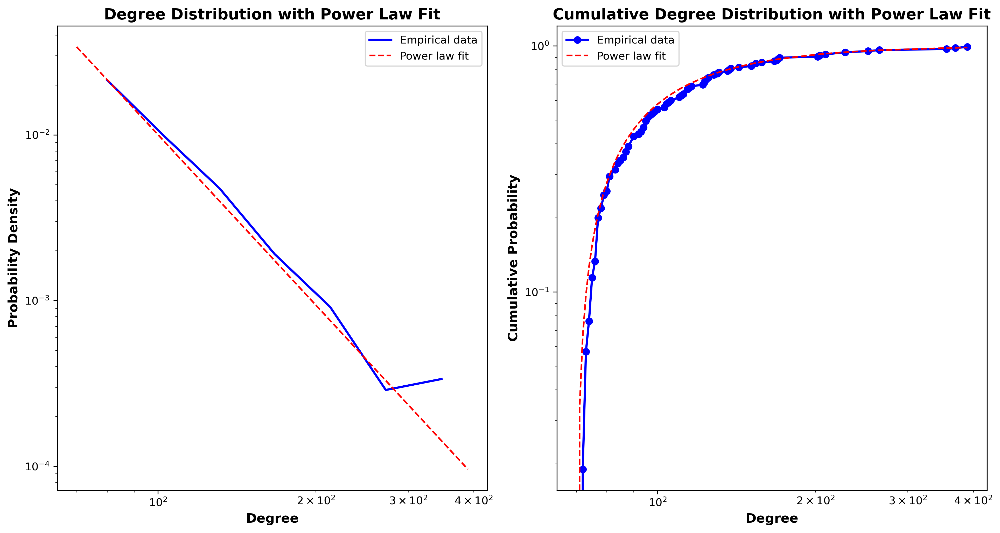

# PRADWIL

# Social network analysis of Prader Willi Syndrome research collaboration network

## Abstract
## Introduction

Prader-Willi syndrome (PWS) is a genetic disorder recognized as the most common genetic cause of life-threatening childhood obesity. According to the Foundation for Prader-Willi syndrome Research (citation), PWS occurs in approximately one out of every 15,000 births. It affects males and females with equal frequency and affects all races and ethnicities. Research findings serve as the foundation for advocacy efforts. Building awareness about PWS within the medical community, among policymakers, and in the general public is essential for garnering support and resources to advance research initiatives. Collaborative research on a global scale among researchers, healthcare professionals, accelerate the pace of discovery, leading to more comprehensive insights and innovative solutions.

Graph theory, and particularly social network analysis, are crucial tools for evaluating the quality and effectiveness of research in this field. In our project, we utilized tools developed in graph theory to systematically analyze the structure of the Prader Willi Syndrome research collaboration network.

Starting from the bipartite network of authors and ids we construct the the co-authorship network from its projection. Then we find the connected component and analyze the largest one by looking at density, clustering coefficient and average shortest path. In this subgraph we find the most important nodes ranking them using degree centrality, betweenness centrality, eigenvector centrality and closeness centrality to compute a Borda score. Lastly we use the Louvain algorithm to perform community detection.

## Materials and Methods

### Data acquisition

All data was acquired from National Center for Biotechnology Information (NCBI), which is part of the United States National Library of Medicine (NLM), in particular from the PubMed database \cite{pubmed}. In order to download all the articles needed for the analysis we employed NCBI'S e-utilities on the UNIX command line in a bash script \cite{kans2023entrez}:

### Computational Tools and Python Frameworks Employed

All the code for data acquisition and plotting was executed on a machine with the following specifics:

| Hardware Component Specifics | Value |
| --- | --- |
| Processor | AMD Ryzen 5600X |
| Memory | 64GB DDR4 RAM (2400MHz, 4x16GB configuration) |
| Storage | 500GB NVMe SSD, Two 10TB HDDs |
| Graphics Processing Unit (GPU) | Nvidia RTX 2070 |
| Operating System | Linux Ubuntu 20.04 |

The computational framework leveraged the capabilities of various software tools and libraries tailored to the specific requirements of the research. 
Notably, the following key components played a crucial role:

Python Libraries:

- **NetworkX**: Utilized for the creation, manipulation, and analysis of complex networks and graph structures.
- **Matplotlib**: Employed for data visualization, including the creation of static, interactive, and animated plots.
These Python libraries facilitated the implementation of sophisticated graph-based algorithms and streamlined the visualization of research findings.

### Construction of the authors collaboration network

We start by constructing the author-paper bipartite network $ G = (U, V, E)$, where the disjoint and independent sets of nodes $U$ and $V$ represent authors and papers, while the links between them denote the authorship relation. 
Subsequently, we derive the coauthorship collaboration network from the original bipartite network by projecting it onto the set of author nodes. 

In this new graph, denoted as $G' = (V, E)$, each author is represented by a vertex $v_i$, while the existence of an edge between two different authors means that there exists at least one path between them in the original bipartite graph $G'$, indicating a shared paper.

We decided to employ a weighted projection of $G$ to obtain $G'$. The weight of each edge corresponds to the number of common nodes in the original bipartite graph $G$, reflecting the number of papers authors have published together. 

This network structure aligns with the concept that frequent collaborators should exhibit stronger connections in the coauthorship collaboration network compared to authors with fewer shared publications.

### Methods for the analysis of the authors collaboration network
#### Metrics for network characterization

In order to characterize the structure of the coauthorship collaboration network, we tested the connectedness of the graph and we look for the different connected components.
We found that the graph is not connected, and it is composed of 1442 connected components. 
We filtered out the components with one single node, and we found that the largest connected component contains
9289 nodes, which is about 56% of the total number of nodes in graph.
We then analyzed the largest connected component by computing the following network metrics:

- Density: 
The density of a graph is defined as the ratio between the number of edges in the graph and the maximum number of edges in a graph with the same number of nodes:

$$
D = \frac{2m}{n(n-1)}
$$

where $m$ is the number of edges in the graph and $n$ is the number of nodes in the graph.
The value of the density ranges from 0 to 1, and it is equal to 1 for a complete graph (a graph in which each node is connected to all other nodes), and it is equal to 0 for a graph without edges.

- Average clustering coefficient (weighted and unweighted):

The local clustering coefficient in an undirected and unweighted graph for a node $i$ is defined as the fraction of potential triangles involving that node that actually exist in the graph:

$$
C_i = \frac{2t_i}{k_i(k_i-1)}
$$

where $t_i$ is the number of triangles through node $i$ and $k_i$ is the degree of node $i$.
The average clustering coefficient of a graph is the average of the local clustering coefficients of all the nodes in the graph:

$$
C = \frac{1}{n} \sum_{i=1}^n C_i
$$

On the other hand, there are several way for defining the local clustering coefficient in a weighted graph.
In our project, we used the geometric average of the subgraph edge weights:

$$
c_u = \frac{1}{k_u(k_u-1)} \sum_{i,j \in N(u)} \sqrt{w_{ij} w_{iu} w_{ju}}
$$

where $N(u)$ is the set of neighbors of $u$ and $w_{ij}$ is the weight of the edge between $i$ and $j$.
The average clustering coefficient of a weighted graph is the average of the local clustering coefficients of all the nodes in the graph:

$$
C = \frac{1}{n} \sum_{i=1}^n c_i
$$

The clustering coefficient is a measure of the degree to which nodes in a graph tend to cluster together.
A high clustering coefficient indicates that many nodes in the graph tend to cluster together, while a low clustering coefficient indicates that nodes tend to be more isolated.
In our context, we measured the clustering coefficient of the largest connected component of the coauthorship 
collaboration network for both the weighted and unweighted case.

- Average shortest path

The average shortest path of the collaboration network is the average number of steps along the shortest paths for all possible pairs of network nodes. 
The mathematical expression for the average shortest path in the unweighted case is:

$$
L = \frac{1}{n(n-1)} \sum_{i \neq j} d(v_i, v_j)
$$

where $d(v_i, v_j)$ is the shortest path between the nodes $v_i$ and $v_j$.

For defining the shortest path in a weighted graph, we need to take into account the fact that in a weighted graph, the shortest path between two nodes is the path with the lowest sum of edge weights, since the weights are interpreted as distances or costs.
However, in our context, an higher weight between two nodes indicates a stronger collaboration between the two authors, so that, when computing the shortest path of the weighted graph, we need to take into account the fact that the shortest path between two nodes is the path with the highest sum of edge weights.
The new weight scheme is therefore defined as the reciprocal of the original weights.

The average shortest path is a measure of the efficiency of information exchange in a network.

#### The scale free property

One of the notable models for complex networks is the **scale-free network**, characterized by a degree distribution that follows a heavy-tailed power law. 
This implies an abundance of nodes with degrees significantly higher than the average, and this property is associated with the network's **robustness**. 
To investigate this, we analyzed the power-law degree distribution of the coauthorship collaboration network using methods outlined in (*citation*).

The analysis involves the following steps:

1. Firstly, we fit the tail of the empirical distribution of the degree with a power-law distribution:

$$
p(d) \propto d^{-\alpha}
$$

Here, \( \alpha \) is a constant parameter, typically \( 2 < \alpha < 3 \). 
In our context, \( d \) represents the degrees of nodes, and \( p(d) \) represents the probability degree distribution of the network, normalized to one. 
In most cases, the power law model is applicable only on the tail of the empirical distribution, 
meaning for degrees greater than a minimum d_{\text{min}}. 
The fitting function will be characherized by an estimated scaling parameter $\hat{\alpha}$ and the lower 
bound $d_{\text{min}}$ .
Then we compute the value $D$ of the Kolmogorov-Smirnov (KS) statistics for this fit, which is interpreted as a "distance" between the empirical distribution and the fitted power law.

Then, in order to assess the goodness of the fit, we use the following procedure:

2. We generate a substantial number of synthetic datasets mimic the distribution of the empirical data below \(d_{\text{min}}\)  while following the fitted power law above \(d_{\text{min}}\). 
In particular, we generate from the fitted power law a number of synthetic datasets equal to the number of elements in the original dataset which have degree greater than \(d_{\text{min}}\); while for the remaining elements we sample uniformly at random from the observed data set that have degree less than \(d_{\text{min}}\).

3. We individually fit each synthetic dataset to its own power-law model and calculate the KS statistic for each 
one relative to its own model.

4. Finally, the goodness of the fit is assessed through the *p-value*,  which is computed as the fraction 
of times the KS statistics of the syntetic datases is larger than the observed KS distance. 
The *p-value* is therefore interpreted as a measure of the plausibility of the hypothesis that our data conforms 
to a power-law distribution. 

A large *p-value* suggests that the difference between empirical data and the model can be attributed to 
statistical fluctuations. Conversely, if the *p-value* is smaller than a specified threshold (in our case, \(0.1\)),
the model does not provide a plausible fit for the data, and the hypothesis is rejected.
To achieve accuracy to about two decimal places, we generate \(2500\) synthetic sets. 

We performed the degree distribution analysis on the coauthorship collaboration network using the powerlaw package for Python.

#### Identification of the most influential nodes

The identification of the most influential nodes in a network is a fundamental task in network analysis, 
since it allows to identify the nodes that are most important for the structure and the functioning of the network.
There are many metrics that can be used to evaluate the importance of a node in a network, each of them
capturing a different aspect of the node's importance.
In this section, we will describe some of the most common metrics for node importance evaluation,
and we will use them to identify the most influential authors in the Alzheimer's disease collaboration network.

- Degree centrality

The degree centrality quantifies the importance of a node in a network by computing the degree of each node (
i.e. the number of links that the node has with other nodes in the network),
and then normalizing it by the maximum possible degree in the network (which is given by the number of nodes
minus one): 

$$
C_D(v) = \frac{k_v}{n-1}
$$

where $k_v$ is the degree of the node $v$ and $n$ is the number of nodes in the network.
The degree centrality assigns a higher score to the nodes with a higher degree, meaning that the nodes with
more links are considered more important.

- Betweenness Centrality

Betweenness centrality is a measure that assesses the importance of a node in a network by calculating the 
number of shortest paths passing through that node for all pairs of nodes in the network. 
The measure is then normalized by the maximum possible number of shortest paths between all pairs of nodes 
in the network. 
Mathematically, it is expressed as:

$$
C_B(v) = \frac{\sum_{s \neq v \neq t} \sigma_{st}(v)}{\sum_{s \neq t} \sigma_{st}}
$$

Here, $\sigma_{st}$ represents the number of shortest paths between nodes $s$ and $t$, and $\sigma_{st}(v)$ 
denotes the number of those paths that traverse the node $v$. Betweenness centrality identifies nodes that act 
as crucial bridges between different sections of the network, playing a pivotal role in the flow of information.

In our specific context, we need to consider the coauthorship collaboration network as a weighted graph. 
Consequently, when calculating shortest paths, we must treat paths with higher weights as "shortest", reflecting 
more frequent collaborations between authors. However, in algorithms for computing shortest paths, weights are 
often interpreted as distances or costs, implying that shorter paths have lower weights.

Therefore, in our calculations for betweenness centrality, we must account for the weighted nature of the graph 
by taking the reciprocal of the weights. 
This adjustment ensures that the algorithms correctly identify paths with the highest collaborative significance, 
aligning with the notion that heavier weights represent stronger connections between authors.

- Closeness centrality

The closeness centrality is defined as the inverse of the average distance between a node and all other nodes.
For each node $v$ in the network, the closeness centrality is computed by calculating the average of the distances 
from the node $v$ to all other nodes in the network (length of the shortest path between $v$ and the other nodes),
and then taking the reciprocal of this value:

$$
C_C(v) = \frac{1}{\frac{1}{n-1} \sum_{u \neq v} d(v,u)}
$$

where $d(v,u)$ is the length of the shortest path between the nodes $v$ and $u$, and $n$ is the number of nodes
in the network.

Closeness centrality provides a metric for evaluating how proximate a node is to all other nodes within a network. 
Nodes exhibiting high closeness centrality can efficiently reach all other nodes in the network in a limited number 
of steps. This measure is indicative of how rapidly information can disseminate from a particular node to the 
entire network.

Similar to the considerations for betweenness centrality, the computation of shorter paths in a weighted graph 
necessitates the adjustment of weights. 
Also in this case, we take the reciprocal of the weights to properly account for the weighted nature of the graph. 

- Eigenvector centrality

The eigenvector centrality measures the importance of a node in a network by considering the importance of 
its neighbors, providing a recursive definition of node importance.

The eigenvector centrality \(x_i\) for node \(i\) is defined as:

$$
x_i = \frac{1}{\lambda} \sum_k a_{k,i} \, x_k
$$

where \(A = (a_{i,j})\) represents the adjacency matrix of the network, \(\lambda \neq 0\) is a constant, 
and \(x_k\) is the centrality of node \(k\). The same relationship can be expressed in matrix form as:

$$
\lambda x = x A
$$

where \(\lambda\) is the eigenvalue and \(x\) is the eigenvector of the adjacency matrix \(A\).

Consequently, the eigenvector centrality is given by the eigenvectors associated with the largest eigenvalue 
of the adjacency matrix of the network.

For computing the eigenvector centrality of the coauthorship collaboration network, we employed the power 
iteration method. 
This iterative technique starts with a random vector and repeatedly multiplies it by the adjacency matrix 
of the network until the vector converges to the eigenvector associated with the largest eigenvalue of the 
adjacency matrix. At each iteration, the vector is normalized to prevent it from growing indefinitely.

- Final ranking with Borda count

After the evalution of the importance of each node in the network using the four metrics described above,
we combined the results of the four metrics to obtain a final ranking of the most influential authors in the
Alzheimer's disease collaboration network.

In order to combine the results, we used the Borda count method, which is a single-winner election method in
which voters rank candidates in order of preference.
In particular, for each metric, we ranked the authors in descending order according to the value of the metric,
and we assigned to each author a score equal to the number of authors that are ranked below him.
Then, we summed the scores obtained by each author for each metric, and we ranked the authors according to
the total score.

#### Community detection and Louvain algorithm

Community detection is the process of identifying groups of nodes that are more densely connected to each 
other than to the rest of the network. This can be useful in order to understand the structure of the network and to identify nodes wich shares similar
characteristics or functions.
In our context, communities represent groups of authors that have a higher tendency to collaborate with each other.
There is no universally accepted definition of what constituets a community, but there are several measures
that can be used to evaluate the quality of a community partition of a network.
In general, a good community partition is characterized by a high density of edges within communities and a 
low density of edges between communities.
So that, a measure of the quality of a community partition of a network is the modularity, which, for an undirected 
network, is defined as:

$$
Q = \frac{1}{2m} \sum_{i,j} \left[ A_{ij} - \frac{k_i k_j}{2m} \right] \delta(c_i, c_j)
$$ 

where $A_{ij}$ is the element of the adjacency matrix of the network, $k_i$ and $k_j$ are the degrees of the 
nodes $i$ and $j$, $m$ is the number of edges in the network, $c_i$ and $c_j$ are the communities to which 
the nodes $i$ and $j$ belong, and $\delta(c_i, c_j)$ is the Kronecker delta function, which is equal to 1 
if $c_i = c_j$ (the nodes $i$ and $j$ belong to the same community) and 0 otherwise.
Modularity ranges from -1 to 1, and a value greater than 0.3 is generally considered as a good partition.
The modularity is positive if the number of edges within communities is greater than the expected number of
edges in a random network with the same degree distribution.
There are several algorithms for community detection, and many of them are based on the maximization of the
modularity.
In our project, we performed the community detection using the Louvain algorithm, which is a modularity-based,
agglomerative, heuristic method.
This algorithm, proposed by Blondel et al. in 2008, have been shown to be very fast and to produce partitions 
with a high modularity.
It consists of two phases: 
1. The algorithm starts by assigning each node to its own community. Then, for each node in the network, it
evaluates the gain in modularity that would result from moving the node to each of its neighbors' communities as:

$$
\Delta Q = \frac{1}{2m} \left[ \frac{\sum_{in} + k_{i,in}}{2m} - \left( \frac{\sum_{tot} + k_i}{2m} \right)^2 \right] - \frac{1}{2m} \left[ \frac{\sum_{in}}{2m} - \left( \frac{\sum_{tot}}{2m} \right)^2 - \left( \frac{k_i}{2m} \right)^2 \right]
$$

where $\sum_{in}$ is the sum of the weights of the links between the node $i$ and the nodes in the community
to which $i$ belongs, $\sum_{tot}$ is the sum of the weights of the links between the node $i$ and all the
nodes in the network, $k_i$ is the degree of the node $i$, $k_{i,in}$ is the sum of the weights of the links
between the node $i$ and the nodes in the community to which $i$ belongs, and $m$ is the sum of the weights
of all the links in the network.
The order im which the nodes does not have significant influence on the final modularity value, but it 
may affect the computational time. 
The node is then moved to the neighbor's community that results in the largest increase in modularity.
This process is repeated iteratively until no further increase in modularity can be achieved.

2. In the second phase, the algorithm builds a new network whose nodes are the communities found in the first
phase. The weights of the links between the communities are equal to the sum of the weights of the links
between the nodes in the two communities. The algorithm then repeats the first phase on this new network.

The two phases are repeated iteratively until a maximum of modularity is reached.

The Louvain algorithm is an agglomerative and hierarchical method, meaning that it starts from the nodes
and builds the communities from the bottom up.

## Results 

### Description of the dataset and preliminary analysis

We acquired from the PubMed database 4606 papers' ids related to Prader Willi Syndrome; for each of them, we extracted the authors' names and the year of publication.
The resulting dataset contains papers published between ... and ... with an average of ... authors per paper.
We performed a preliminary analysis of the dataset in order study the evolution of the number of publications,
the number of authors and the number of authors per paper over time.
The following figures show how these quantities evolved by a ...-year window over the period ...-... .

We observed that all the three quantities increased over time; in particular, the number of publications
followed a linear trend, while the number of authors followed an exponential trend.

### The coauthorship collaboration network

We constructed the coauthorship collaboration network from the bipartite network of authors and ids.
The resulting network contains ... edges and ... nodes, where ... are authors nodes and ... are paper nodes.
The following figure shows the resulting bipartite network:

We then projected the bipartite network onto the set of author nodes, obtaining the weighted coauthorship collaboration network. 
The network contains ... edges and ... nodes and it is not connected.
We found that the collaboration network is composed of ... connected components, and the distribution of the
number of nodes in the connected components is shown in the following figure:

The largest connected component contains ... nodes, which is about ...% of the total number of nodes in the network;
all the other connected components are much smaller, and they contain less than ... nodes.
We therefore decided to focus our analysis on the largest connected component.

### Metrics for network characterization

In order to characterize the structure of the coauthorship collaboration network, we computed the density, the
average clustering coefficient and the average shortest path of the largest connected component.
The clustering coefficient and the average shortest path were computed both for the weighted and unweighted case.
The results are summarized in the following table:

| Metric | Weighted | Unweighted |
| --- | --- | --- |
| Density |  |  |
| Average clustering coefficient |  |  |
| Average shortest path |  |  |

### The scale free property

Firstly, we estimate the scaling parameter $\hat{\alpha}$ and the lower bound $d_{\text{min}}$ of the fitted power law and we compute the value $D$ of the Kolmogorov-Smirnov (KS) statistics for this fit.
The results are summarized in the following table:

| Parameter | Value |
| --- | --- |
| $\hat{\alpha}$ |  |
| $d_{\text{min}}$ |  |
| $D$ |  |

The plot of the empirical degree distribution and the cumulative degree distribution are shown in the following figures:

After that, we estimate the *p-value* of the goodness of the fit, which is found to be equal to $p = $.
The large *p-value* suggests that the difference between empirical data and the model can be attributed to
statistical fluctuations, and therefore the model provides a plausible fit for the data. 

### Identification of the most influential nodes

We identified the most influential authors in the coauthorship collaboration network by compunting the degree
centrality, the betweenness centrality, the closeness centrality and the eigenvector centrality of each node.
These metrics are used to evaluate the importance of a node in a network by capturing different aspects of
the node's importance, the final ranking is obtained by combining the results of the four metrics using the
Borda count method.
In the following table, we show the top 10 authors according to each metric and the final ranking:

| Degree centrality | Betweenness centrality | Closeness centrality | Eigenvector centrality | Borda score |
| --- | --- | --- | --- | --- |
|  |  |  |  |  |
|  |  |  |  |  |
|  |  |  |  |  |
|  |  |  |  |  |
|  |  |  |  |  |
|  |  |  |  |  |
|  |  |  |  |  |
|  |  |  |  |  |
|  |  |  |  |  |
|  |  |  |  |  |

### Community detection and Louvain algorithm

We performed the community detection using the Louvain algorithm (for reproducibility, we fixed the random seed to 42). The algorithm identified 73 different communities, and the distribution of the number of nodes in the communities is shown in the following figure:

The largest community contains ... nodes, which is about ...% of the total number of nodes in the network.
The modularity of the final partition is about $Q = 0.904$.

## Discussion

## Conclusion